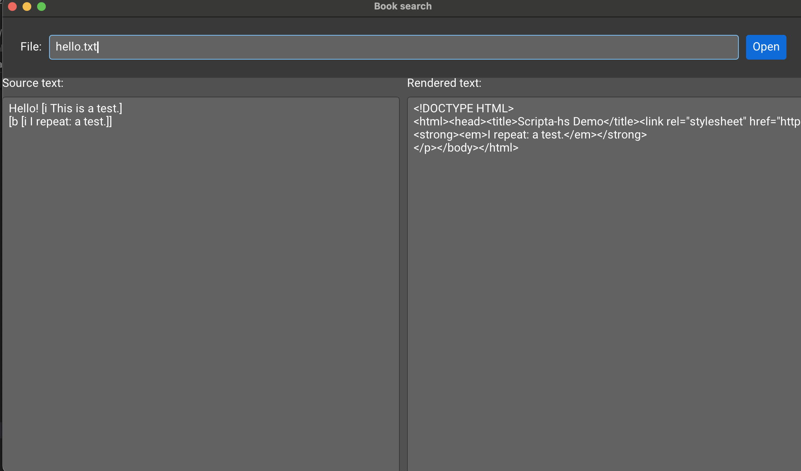

# Scripta-Monomer

A start on a desktop app in Haskell for real-time editing and compilation of text in the L0, MicroLaTeX and XMarkdown markup languages.

The app uses the Monomer library — https://hackage.haskell.org/package/monomer, https://github.com/fjvallarino/monomer

The screenshot below shows progress to date (Sept 14, 2022).  So far the user can 

    - open a file
    - whereupon the source text is displayed in the left window
    - the rendered text is displayed as HTML text in the right window

The next step is for the right window to render the compiled text as HTML.

See https://scripta.io for the web app that this work is based on.
